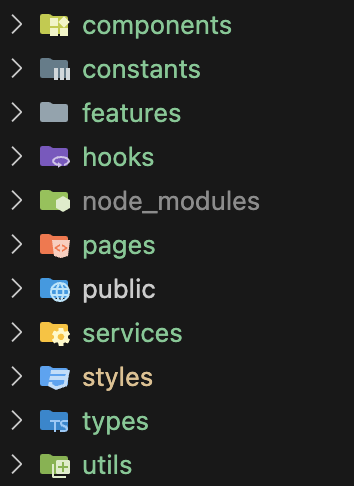
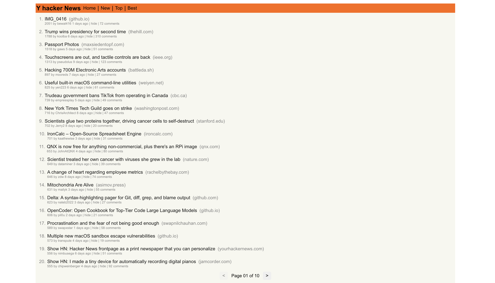
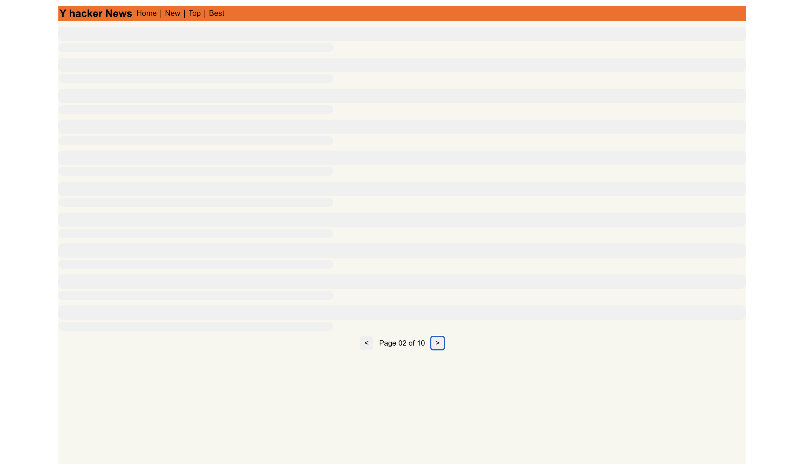
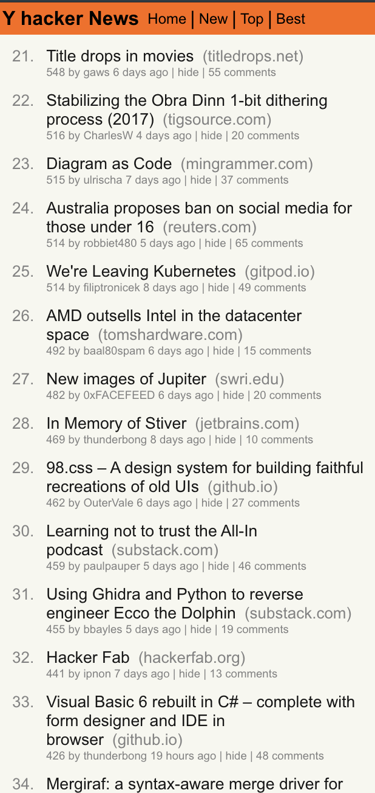

An application to show tranding news using [HackerNews API](https://github.com/HackerNews/API "HackerNews API"). Live on [https://newsroom-eta.vercel.app/](https://newsroom-eta.vercel.app/)

## Features & Tech stack

* Next.js page routing framework used
* Has discreate folder structure for better scalablity and understanding
* **Dynamic route** to show pages for three different stories: **Top, New, and Best**
* Shimmer UI for loader
* **Responsive** for all screen devices
* Custom reusable components, utility fucntions and hooks
* React-Query for network call state management and caching
* **404 file** to grep unrecognised invalid routes and redirect to home route.
* **Pagination** and fetching paginated data

  **Note:**

  1. Due to the api limitations, Could not find any api which returns data in a single call. Here, first api gives the Id of news stories and another api to get content of a perticular news story.
  2. Application is relatively small and has not much states, hence did not see the need of using Redux/Context Api. But with scale these should be integrated for state management


**Tech used:**

Next.js, Typescript, Axios, Turbopack, Tanstack React-Query, 

## Codebase documentation

```
## make sure has node v20 or above
npm install

## if this does not work, try 
npm install --force

## to start server at http://localhost:3000
npm run dev
```


**File structure**



* **components :** Generic reusable components like button, loader and others.
* **constants:** stores all data which are contants  and needed throughout the app like apis url, routes etc
* **features:** feature specific reusable components
* **hooks:** stores custom hooks pertaing to a feature following feature specific nomenclature.
* **pages:** stores page routes
* **public:** stores static assets
* **services:** has all network request making functions
* **styles:** stores css files
* **types:** stores exportable types used thoughout the app
* **utils:** stores all utility functions.


## Way forward

* Adding middleware, errorboundary, state management tools like redux, reducer or context api, axios

## Snapshots

| Web                                            | shimmer ui                                     | Mobile                                         |
| ---------------------------------------------- | ---------------------------------------------- | ---------------------------------------------- |
|  |  |  |

## Deploy on Vercel

Deployed on vercel, can be visited at [https://newsroom-eta.vercel.app/](https://newsroom-eta.vercel.app/)
